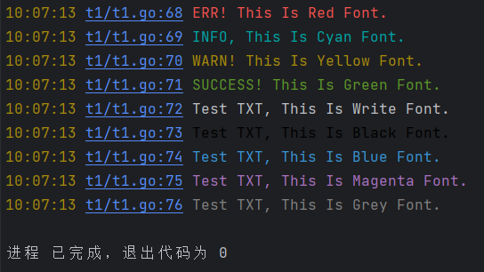

# 介绍
涵盖9种颜色的标准输出，同时可控制输出时间、代码位置，帮助快速定位关键代码

由于平时习惯性的添加许多测试用的输出，多了后控制输出内容显得非常乱，而在杂乱的输出中很难找出关键内容，甚至记不起某一条内容是在代码中哪添加的。

故设计字体具有简单颜色和带有语句具体位置的输出方法，其实现也就是封装了`fmt`包的方法

# 实现功能
1. 可控制是否输出日期
2. 可控制是否输出语句在代码中的具体位置
3. 可输出 9 中不同颜色字体

# Example
```go
vvu.Config("t1", true, true) // 表示项目名称为 t1, 开启时间与位置输出

vvu.PrintC("ERR! This Is Red Font.").Red()
vvu.PrintC("INFO, This Is Cyan Font.").Cyan()
vvu.PrintC("WARN! This Is Yellow Font.").Yellow()
vvu.PrintC("SUCCESS! This Is Green Font.").Green()
vvu.PrintC("Test TXT, This Is Write Font.").Write()
vvu.PrintC("Test TXT, This Is Black Font.").Black()
vvu.PrintC("Test TXT, This Is Blue Font.").Blue()
vvu.PrintC("Test TXT, This Is Magenta Font.").Magenta()
vvu.PrintC("Test TXT, This Is Grey Font.").Grey()
```
// Output:

